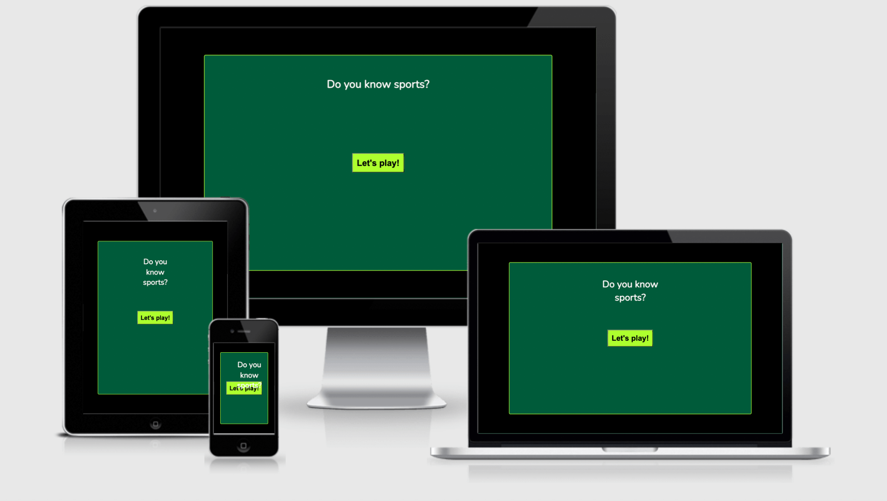

# Quiz it is! 

This quiz is for anyone interested in sports and want to try their knowledge. 
Play against familly or friends and see who scores the highest score!

## Features

### Existing Features

## Features left to implement

Working quiz to start with. 

## Testing

### Validator Testing

- HTML
Messy code and came back with many bugs due to my performance to try and fix my JavaScript code. W3C validator

-CSS
No errors were found when passing through the official Jigsaw validator. A bit messy also due to the same reason as above. 

- Lighthouse came back with good accessability. 

## Unfixed bugs
Whole web application is a bug at the moment. 

## Deployment

The site was deployed to GitHub pages. The steps to deploy are as follows:
In the GitHub repository, navigate to the Settings tab
From the source section drop-down menu, select the Main Branch
Once the main branch has been selected, the page will be automatically refreshed with a detailed ribbon display to indicate the successful deployment.
The live link can be found here - [Quiz it is](https://ookale.github.io/Quiz-it-is-/)

## Content

Questions composed by myself. 

Adding questions must follow format:

## Credits

### Videos taken from Youtube.

[Learn {to} Code](https://www.youtube.com/watch?v=icb9AUBeznQ)

[Web Dev Simplified](https://www.youtube.com/watch?v=riDzcEQbX6k)

[Brian Design](https://www.youtube.com/watch?v=f4fB9Xg2JEY)

### Sites I found with some help on how to explain the process

[Sitepoint](https://www.sitepoint.com/simple-javascript-quiz/) helped me to grasp some of the JavaScript language on how to write code for a quiz. Unfortunately I found it too late in the process of my milestone project. 

[Wes Bos](https://wesbos.com/template-strings-html)

